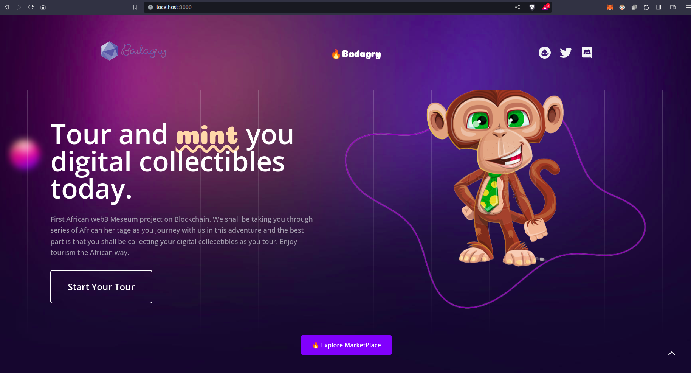

# Badagry - First African web3 Meseum for preserving the African heritage through story telling

## Introduction

## Deliverables : Submitted projects should have:

### 1. Project / Team name 
Badagry 

### 2. Short description about the project
Badagry - First African web3 Meseum for preserving the African heritage through story telling, As we intend to onbaord more web3 users, it is pertinent that the tourism section of Africa be considered. This project seek to bring the blockchain technology into the African tourism (meseum) Space. Users from all around the world can see some of the African heritage without leaving the shores of their country. They also buy collecetibles as proof of their visit.

### 3. Discord and Telegram username for the team’s person of contact
holyaustin#3735

### 4. Repository with project’s code 
https://github.com/holyaustin/Badagry

### 5. Video demo (90 seconds) and/or Presentation (10 slides max)
https://youtu.be/Vtdscnftpog (90 secs)

https://youtu.be/9YQon2ihLLE (Extended Version)

### 6. The contract address(es) or website URLs of your deployed application, either on a testnet of your choice or mainnet of a platform of choice.
https://goerli.basescan.org/address/0xd547726541fb37db19fdb263f4855ba969034071

## Project Title:

Badagry - Unveiling Africa's Heritage Through Web3 Museum and Collectibles

## Project Description:

Introducing Badagry, an innovative and groundbreaking venture that marries the rich tapestry of African heritage with cutting-edge blockchain technology. Badagry is the First African web3 Museum, a virtual portal to the past that transcends geographical boundaries, enabling users worldwide to embark on an immersive journey through Africa's history, culture, and heritage. They also buy collecetibles as proof of their visit.

## Problem Statement:

In today's increasingly interconnected world, the preservation and appreciation of diverse cultures and heritage are crucial. However, physical barriers, limited access, and the risk of cultural dilution often hinder people from experiencing the richness of global heritage. This gap in cultural understanding calls for an innovative solution that transcends geographical constraints, educates, and empowers users to connect with and own a piece of history, regardless of their location.

## The Vision:

At the core of Badagry lies a visionary mission - to preserve and celebrate Africa's diverse heritage through the power of storytelling and blockchain technology. This digital museum redefines the way we experience culture and history, offering a platform where users can explore, learn, and own a piece of African history without leaving the confines of their country.

## Key Features:

Virtual Exploration: Badagry provides an immersive digital space where users can navigate through meticulously curated exhibits, showcasing the monumental milestones, artistic expressions, and hidden gems of African heritage. With user-friendly navigation, users can effortlessly explore different eras, regions, and themes.
Authentic Storytelling: Immerse yourself in authentic narratives that have shaped Africa's history. From ancient kingdoms to modern revolutions, Badagry's storytelling ensures that each piece of content is accurate, respectful, and culturally representative.
Web3 Collectibles: In a groundbreaking convergence of blockchain and heritage, Badagry introduces a collectibles marketplace. Every user can own a unique piece of Africa's history in digital form. These collectibles are authenticated on the blockchain, offering a tangible connection to the past.
Global Accessibility: Badagry bridges continents and cultures, offering content in multiple languages to ensure inclusivity. Whether you're in Africa or beyond, you can access and appreciate Africa's heritage.
Partnerships with Experts: We collaborate with esteemed historians, cultural experts, and artists to ensure that our content is not only accurate but also offers fresh perspectives and insights.
Educational Resources: Badagry is not just a museum; it's an educational hub. We offer workshops, webinars, and educational materials that delve deeper into the topics presented, encouraging lifelong learning.
Blockchain Security: The blockchain underpins the authenticity of our collectibles, ensuring their provenance and safeguarding user transactions and data with the highest levels of security.
Impact and Future: Badagry aspires to redefine the relationship between technology, heritage, and global interconnectedness. By fostering cross-cultural understanding and appreciation, it transcends physical boundaries and nurtures a sense of unity among humanity. As we expand, we envision a future where Badagry becomes a comprehensive repository of global heritage, a hub where cultures intermingle, and stories intertwine.
Future Plans:

Interactive Engagement: Engage actively with the content through interactive exhibits, quizzes, and discussions. Delve into the past, challenge your knowledge, and connect with a global community of history enthusiasts. We hope to drive more traffic into the Base blockchain with our platform as well.
Virtual Reality Immersion: Experience history in a whole new dimension with our Virtual Reality integration. Walk through ancient streets, explore architectural marvels, and witness historical events as if you were truly there.
Our ongoing commitment to accuracy, innovation, and user engagement will continually shape the way we experience and connect with history.

Join us in unveiling Africa's heritage, one virtual exhibit and collectible at a time.

Welcome to Badagry - where the past meets the future.

## Tech Stack Used

Client: Next.js, TailwindCSS, web3.js

web3:  Hardhat, ethers.js, IPFS / Filecoin, XMTP

BlockChain: Base Goerli Testnet

## To run the dapp Locally

### npm run dev

Deploying on Base Mainnet
When you are done with making changes and your minting dapp is just as you wanted it is time to deploy on ethereum mainnet. To do that;

Make sure you changed all env variables with yours. And also for the network you need to chose ethereum mainnet.
Update hardhat.config.js so that as network option you use mainnet not rtestnet. hardhat
While deploying your contract with hardhat you need to use mainnet as network-name

# This command will deploy your smart contract on base testnet

  npx hardhat run scripts/deploy.js --network base_testnet

https://goerli.basescan.org/address/0xd547726541fb37db19fdb263f4855ba969034071

https://goerli.basescan.org/address/0x33f88fe3f2410ad58230142af151d9b5840d9b01

https://youtu.be/9YQon2ihLLE

https://dweb.link/ipfs/bafkreiens5gxjvktoyamjtyrzdx3zynp3pqysx4aamjaq7xmoilitwd6v4

https://dweb.link/ipfs/bafkreiaji5ih7pwq4nx5dmzhjwfw23gy74sffw6av77ax5y76n7v3dydcy

https://dweb.link/ipfs/bafkreifm6dg5eh7hwui3fac2jrewiewcu4e7vm5opwuhwznr3p7n4gsdum

https://dweb.link/ipfs/bafkreid3scqqf2tye6aspnxwbht6yk47llmzrfiwrmvxmahqg42ttpxyye

https://dweb.link/ipfs/bafkreidjp2mriqgeaheap2m7o2ypvwj4fb3r3isjtvkdppyiud7z3ek27i

https://dweb.link/ipfs/bafkreigums2o5e7zowjuoincidxvmz77lk7dv2euovxivcgt6lw5pa4pxq

https://dweb.link/ipfs/bafkreibnfbxjehepfjcsp2ukqve3a22grzi6jl2n3ovtmg56vlo5c3jh44

https://dweb.link/ipfs/bafkreiftew6irumtjaxrwj6ywj2mpbjizrr4kdb5p4yjf3e7i2ulaa4boq

https://dweb.link/ipfs/bafkreiazjwjv4xne5ddgw3ffespwnosqrm6ugsgy3fcbiz5e2xch3ygc2e