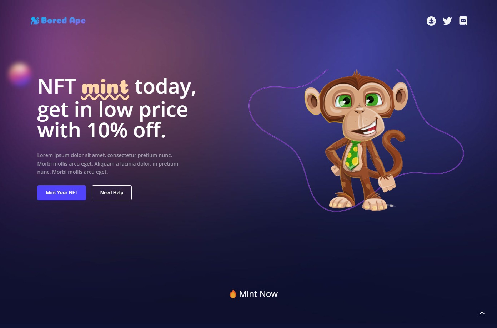

# Badagry - web3 Medium for preserving the African heritage through story telling

## Introduction

## Problem Statement

## Solution

## Tech Stack Used

Client: React, TailwindCSS, web3.js

Server: Alchemy, NextJS, Hardhat

## To run the dapp Locally

### npm run dev

Deploying on Base Mainnet
When you are done with making changes and your minting dapp is just as you wanted it is time to deploy on ethereum mainnet. To do that;

Make sure you changed all env variables with yours. And also for the network you need to chose ethereum mainnet.
Update hardhat.config.js so that as network option you use mainnet not rtestnet. hardhat
While deploying your contract with hardhat you need to use mainnet as network-name

# This command will deploy your smart contract on base testnet

  npx hardhat run scripts/deploy.js --network base_testnet

# This command will verify your smart contract on mainnet etherscan

  npx hardhat run scripts/verifyContract.js --network mainnet
